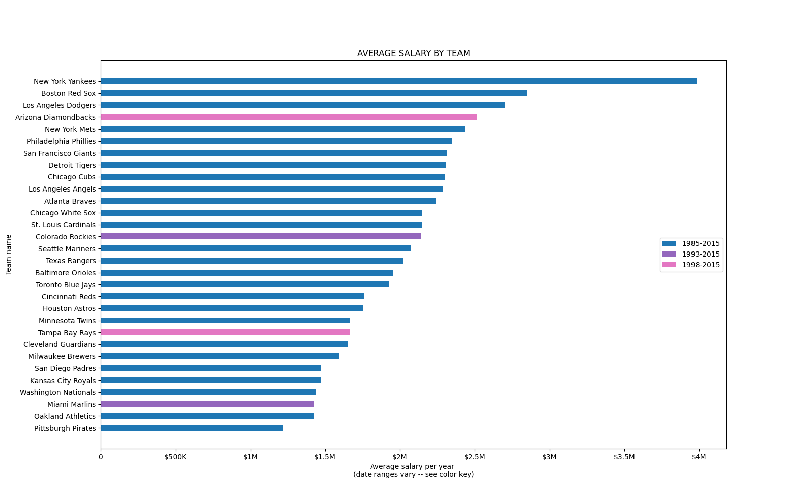

# salary_by_mlb_team
Creating a simple chart of salary information for each MLB baseball team and displaying it in a Streamlit web app

You can run this file by performing the following steps...
1. Clone the repo to your local machine
2. Open the repo in Visual Studio Code
3. Open the terminal in VS Code
4. Type in the following code to run the Streamlit app...
```
streamlit run .\salary_by_team.py
```

## Data visual

